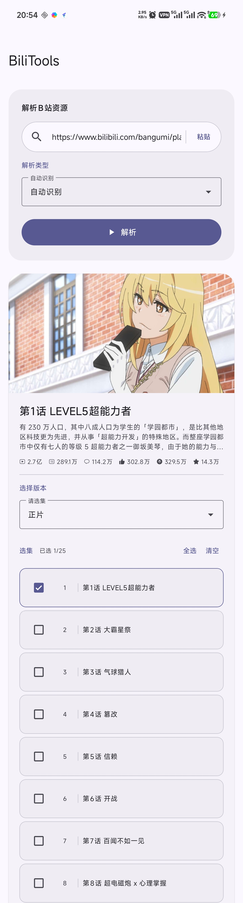
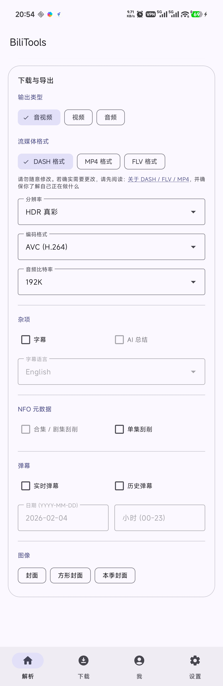
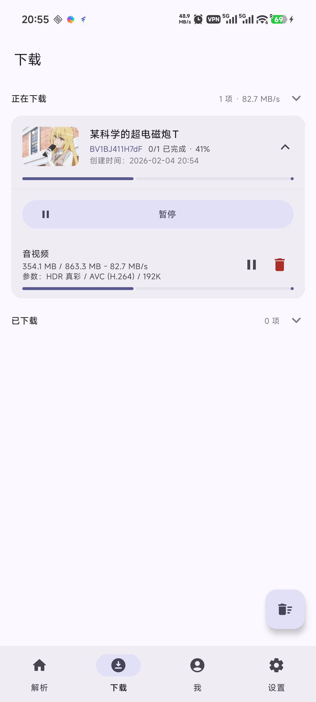
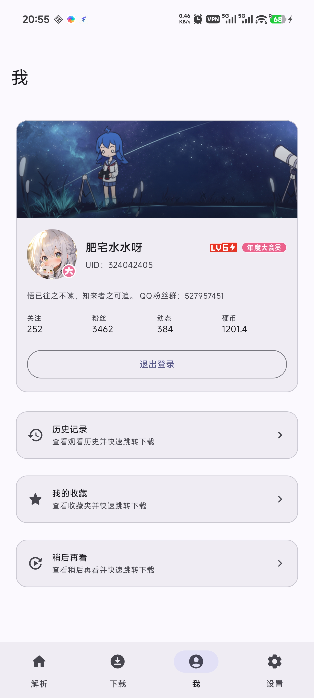
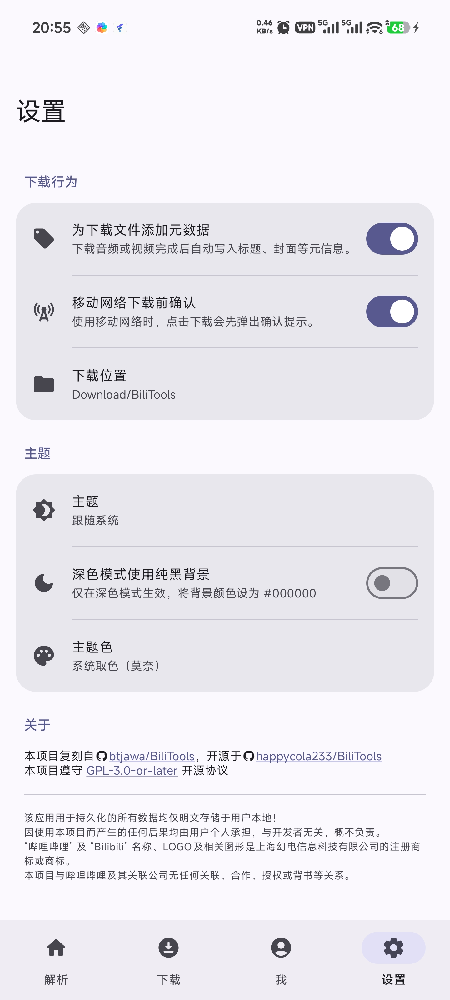

# BiliTools for Android 📺

[](LICENSE)
[](https://kotlinlang.org)
[](https://www.android.com)

**BiliTools** 是一款运行在 Android 平台上的哔哩哔哩（Bilibili）视频解析与下载工具。

> [!NOTE]
> 本项目复刻自 [btjawa/BiliTools](https://github.com/btjawa/BiliTools)，免费开源。

## 📱 APP 截图

<div align="center">

| **首页（解析）** | **首页（下载与导出）** |
|:---:|:---:|
|  |  |

| 下载页 | 个人页 | 设置页 |
|:---:|:---:|:---:|
|  |  |  |

</div>

## ✨ 功能特性

### 🔍 强大的视频解析
*   **多格式支持**：支持解析 链接 / AV号 / BV号 / SS / EP / AU / AM / SID / FID / CV / RL / UID 等多种输入格式。
*   **全类型识别**：自动识别视频、番剧、课程、音频、歌单、稍后再看、收藏夹、图文（Opus）、用户视频/音频等。
*   **详细信息**：展示视频封面、标题、播放量、弹幕数、点赞、投币、收藏等详细数据。

### 📥 专业级下载体验
*   **多种流媒体格式**：
    *   **DASH**：自动合并音频和视频，支持更高画质。
    *   **MP4**：直链下载，兼容性好。
*   **全画质/音质支持**：
    *   **视频**：支持 8K、杜比视界、HDR、4K、1080P60、1080P+、720P 等全部分辨率。
    *   **编码**：支持 AVC (H.264)、HEVC (H.265)、AV1 编码格式。
    *   **音频**：支持 Hi-Res、192K、132K 等高码率音频。
*   **丰富的内容下载**：
    *   视频 / 音频 / 字幕 / AI 总结。
    *   **元数据**：NFO 文件（支持 Kodi/Emby 等刮削），包含单集与合集模式。
    *   **弹幕**：支持下载 XML 格式的实时弹幕和历史弹幕。
    *   **图片**：视频封面、首帧、合集封面、季海报等。
*   **批量下载**：支持批量选集、整个收藏夹或合集下载。

### 👤 账号集成
*   **便捷登录**：支持二维码扫码、账号密码、短信验证码等多种登录方式。
*   **个人中心**：查看账号等级、大会员状态、关注/粉丝/动态/硬币数。
*   **数据同步**：直接访问并下载“我的收藏”、“稍后再看”以及“历史记录”。

### 🛠️ 实用工具与设置
*   **历史记录**：查看观看历史，支持按时长、时间、设备进行筛选，并可快速跳转下载。
*   **元数据写入**：下载音视频时自动写入标题、封面、艺术家等元信息（使用 JAudiotagger）。
*   **个性化主题**：
    *   支持浅色/深色模式（含纯黑夜间模式）。
    *   支持动态取色（Material You / Monet）及多种预设主题色（经典蓝、薄荷绿、暖橙、B站粉）。

## 📱 环境要求

*   **Android 版本**：Android 10 (API Level 29) 及以上。
*   **编译环境**：JDK 11+。

## 🛠️ 构建指南

本项目使用 Gradle 进行构建。

1.  克隆仓库：
    ```bash
    git clone https://github.com/happycola233/BiliTools.git
    cd BiliTools
    ```
2.  使用 Gradle 构建 Debug 包：
    ```bash
    ./gradlew assembleDebug
    ```

## ⚠️ 免责声明

*   **数据安全**：该应用用于持久化的所有数据均仅 **明文存储于用户本地**！
*   **用户责任**：因使用本项目而产生的任何后果均由用户个人承担，与开发者无关，概不负责。
*   **版权声明**：“哔哩哔哩” 及 “Bilibili” 名称、LOGO及相关图形是上海幻电信息科技有限公司的注册商标或商标。本项目与哔哩哔哩及其关联公司无任何关联、合作、授权或背书等关系。

## 📄 许可证

本项目基于 [GPL-3.0-or-later](LICENSE) 协议开源。
