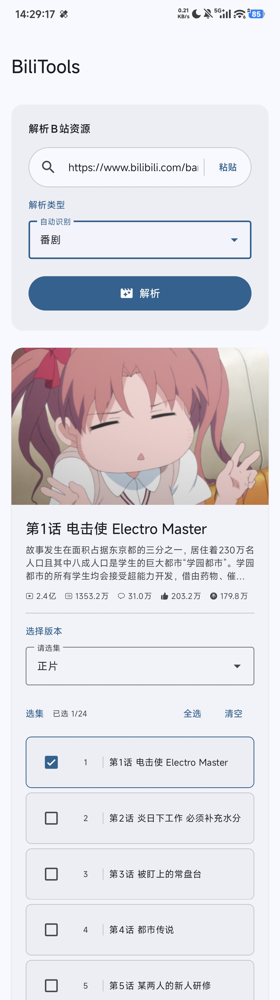
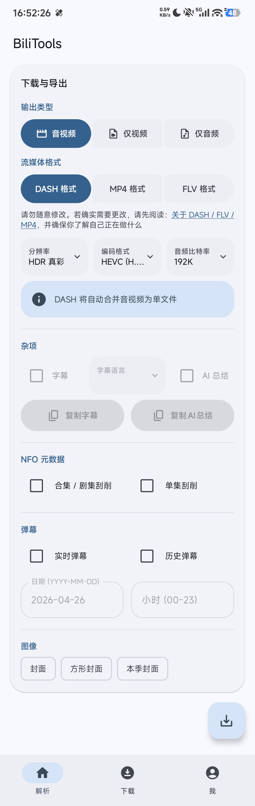
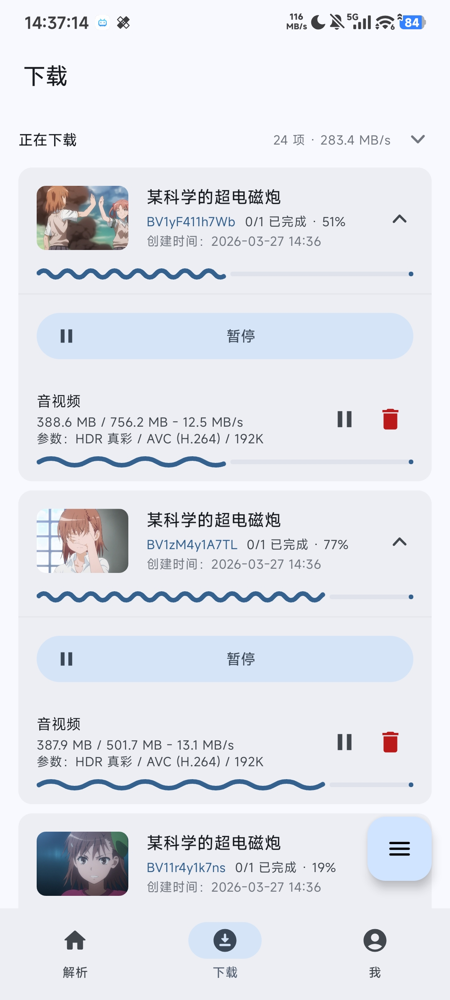
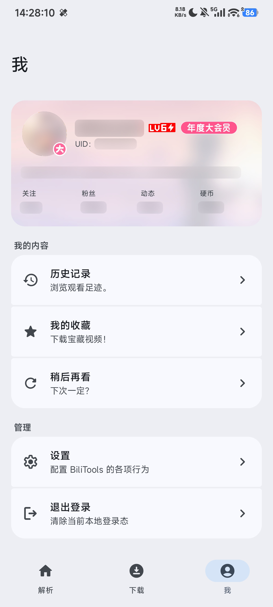
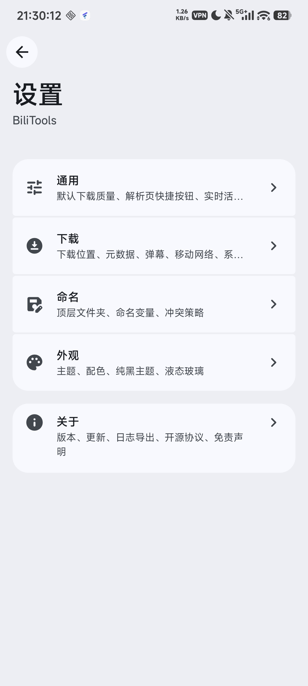
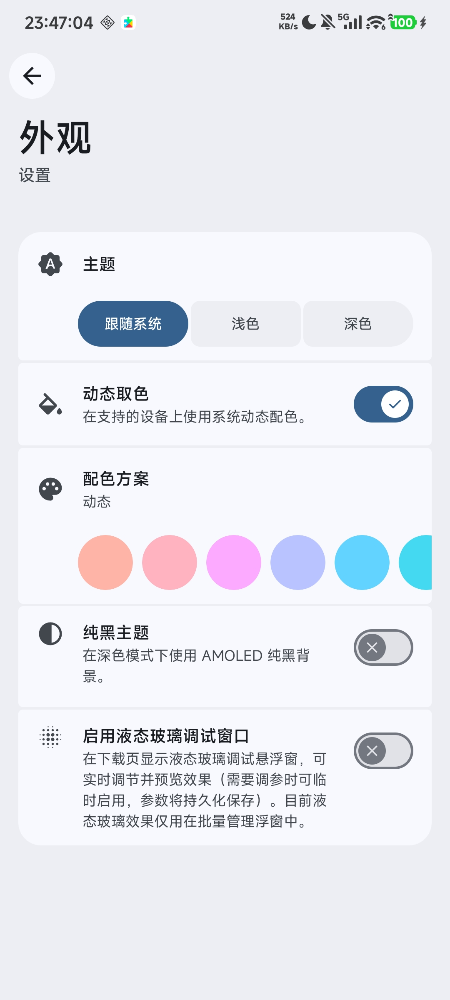

<div align="center">
  
  <h1>BiliTools for Android 📺</h1>
  <p><strong>一款运行在 Android 平台上的强大、清爽、开源的哔哩哔哩（Bilibili）视频解析与下载工具，让你畅享纯粹的下载体验！✨</strong></p>
  
  <p>
    <a href="LICENSE"></a>
    <a href="https://kotlinlang.org"></a>
    <a href="https://www.android.com"></a>
  </p>
</div>

> [!NOTE]  
> 🌟 本项目复刻自 [btjawa/BiliTools](https://github.com/btjawa/BiliTools)，免费开源。

## 📸 APP 截图

采用全新的 **Material Design Expressive** 设计语言，为您提供更加灵动、沉浸与现代化的视觉与使用体验：

<div align="center">
  
| **🏠 首页（解析展示）** | **📥 首页（下载与导出）** | **⬇️ 下载管理页** |
|:---:|:---:|:---:|
|  |  |  |
| **👤 个人中心页** | **⚙️ 全局设置页** | **🎨 设置（个性化外观）** |
|  |  |  |

</div>

## ✨ 功能特性

### 🔍 强大的视频解析
*   **多格式支持**：支持解析 链接 / AV号 / BV号 / SS / EP / AU / AM / SID / FID / CV / RL / UID 等多种输入格式。
*   **全类型识别**：自动识别视频、番剧、课程、音频、歌单、稍后再看、收藏夹、图文（Opus）、用户视频/音频等。
*   **详细信息**：展示视频封面、标题、播放量、弹幕数、点赞、投币、收藏等详细数据。

### 📥 专业级下载体验
*   **多种流媒体格式**：
    *   **DASH**：自动合并音频和视频，支持更高画质。
    *   **MP4**：直链下载，兼容性好。
*   **全画质/音质支持**：
    *   **视频**：支持 8K、杜比视界、HDR、4K、1080P60、1080P+、720P 等全部分辨率。
    *   **编码**：支持 AVC (H.264)、HEVC (H.265)、AV1 编码格式。
    *   **音频**：支持 Hi-Res、192K、132K 等高码率音频。
*   **丰富的内容下载**：
    *   视频 / 音频 / 字幕 / AI 总结。
    *   **元数据**：NFO 文件（支持 Kodi/Emby 等刮削），包含单集与合集模式。
    *   **弹幕**：支持下载 XML 格式的实时弹幕和历史弹幕。
    *   **图片**：视频封面、首帧、合集封面、季海报等。
*   **批量下载**：支持批量选集、整个收藏夹或合集下载。

### 👤 账号集成
*   **便捷登录**：支持二维码扫码、账号密码、短信验证码等多种登录方式。
*   **个人中心**：查看账号等级、大会员状态、关注/粉丝/动态/硬币数。
*   **数据同步**：直接访问并下载“我的收藏”、“稍后再看”以及“历史记录”。

### 🛠️ 实用工具与设置
*   **历史记录**：查看观看历史，支持按时长、时间、设备进行筛选，并可快速跳转下载。
*   **元数据写入**：下载音视频时自动写入标题、封面、艺术家等元信息（使用 JAudiotagger）。
*   **个性化主题**：
    *   支持浅色/深色模式（含纯黑夜间模式）。
    *   支持动态取色（Material You / Monet）及多种预设主题色。

## 🛠️ 构建指南

本项目使用 Gradle 进行自动化构建与依赖管理。构建要求：Android 10 (API Level 29) +，并配置 JDK 17+ 环境。

1.  克隆仓库：
    ```bash
    git clone https://github.com/happycola233/BiliTools.git
    cd BiliTools
    ```
2.  使用 Gradle 构建 Debug 包：
    ```bash
    ./gradlew assembleDebug
    ```

## ⚠️ 免责声明

*   🛡️ **数据安全**：本应用运行时产生及持久化的所有用户数据，均 **仅以明文形式存储于您的本地设备中**，不提供任何云端上传服务，请您妥善保管本设备数据。
*   ⚖️ **用户责任**：因使用本项目而产生的任何后果均由用户个人承担，与开发者无关，概不负责。
*   ©️ **版权声明**：“哔哩哔哩” 及 “Bilibili” 名称、LOGO及相关图形是上海幻电信息科技有限公司的注册商标或商标。本项目与哔哩哔哩及其关联公司无任何关联、合作、授权或背书等关系。

## 📜 开源协议

本项目基于 [GPL-3.0-or-later](LICENSE) 协议开源。
