<div align="center">
  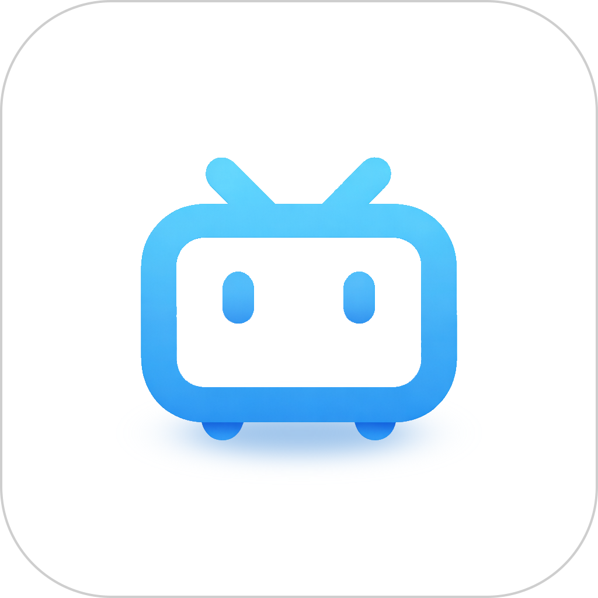
  <h1>BiliTools for Android</h1>
  <p><strong>面向 Android 的哔哩哔哩多媒体解析与下载工具，支持视频、番剧、课程、音频与专栏解析，可自选音画质、导出弹幕与字幕，并保存媒体元数据。</strong></p>
  <p>Material 3 Expressive · 液态玻璃 · 十三套原创配色 · 开源免费</p>
  <!-- 徽标取色：依次为蓝紫、薄荷、丁香、天蓝、青苹；左侧取浅色主题 colorPrimary，右侧取 colorPrimaryFixedDim。 -->
  <p>
    <a href="https://github.com/happycola233/BiliTools/releases/latest"></a>
    <a href="LICENSE"></a>
    <a href="https://kotlinlang.org"></a>
    <a href="https://m3.material.io/blog/building-with-m3-expressive"></a>
    <a href="https://www.android.com"></a>
  </p>

  <p>
    <a href="#-应用截图">应用截图</a> ·
    <a href="#-内容解析">解析</a> ·
    <a href="#-下载与导出">下载与导出</a> ·
    <a href="#-账号与个人内容">账号</a> ·
    <a href="#️-设置">设置</a> ·
    <a href="#界面设计">设计</a> ·
    <a href="#-配色系统">配色系统</a> ·
    <a href="#-安装">安装</a> ·
    <a href="#️-构建">构建</a>
  </p>
</div>

<br/>

### 🔍 多类型内容解析

输入链接或 AV / BV、SS / EP / MD、AU / AM、CV / RL、UID 等标识，识别视频、番剧、课程、音频、歌单、收藏夹、专栏图文与用户空间。

**通过分享菜单即可直接解析下载，无需切换应用。**

### 📥 媒体下载与内容导出

支持最高 8K、杜比视界、HDR 与 Hi-Res 无损音频；可按需导出字幕、AI 总结、当前与历史弹幕、NFO 元数据、封面海报与图文 Markdown。

### 🎨 原生界面与个性化配色

采用 Material 3 Expressive 设计，与液态玻璃有机结合。提供十三套原创配色，支持浅色、深色与 AMOLED 纯黑模式。

<br/>

## 📸 应用截图

> 截图随 GitHub 主题自动切换浅色与深色版本。

<table align="center">
  <tr>
    <td align="center"><b>解析</b></td>
    <td align="center"><b>番剧解析与选集</b></td>
    <td align="center"><b>下载与导出</b></td>
    <td align="center"><b>详细信息</b></td>
  </tr>
  <tr>
    <td><picture><source media="(prefers-color-scheme: dark)" srcset="./docs/assets/screenshots/01-解析_深色.jpg">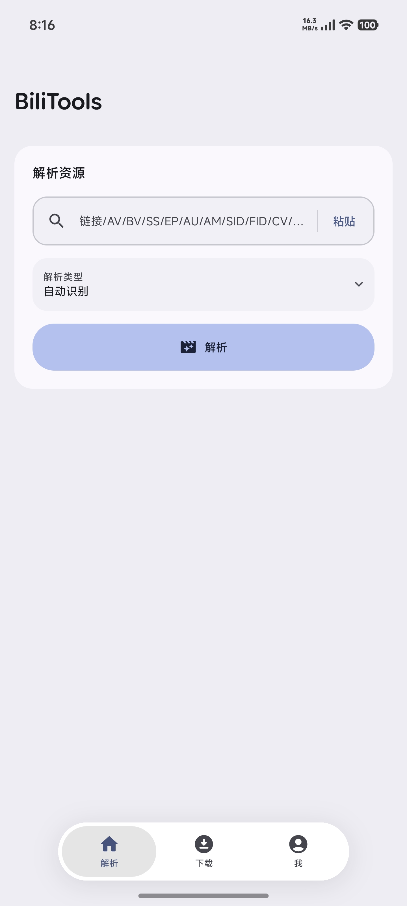</picture></td>
    <td><picture><source media="(prefers-color-scheme: dark)" srcset="./docs/assets/screenshots/02-解析-番剧_深色.jpg">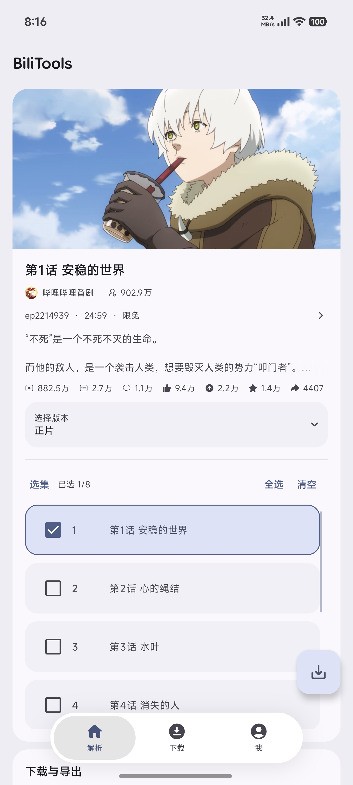</picture></td>
    <td><picture><source media="(prefers-color-scheme: dark)" srcset="./docs/assets/screenshots/03-解析-下载选项_深色.jpg">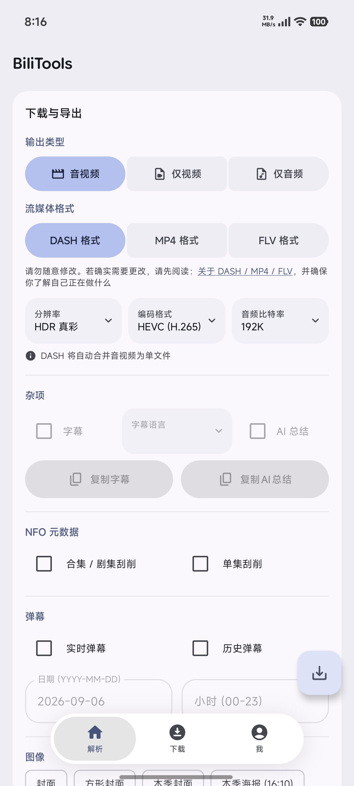</picture></td>
    <td><picture><source media="(prefers-color-scheme: dark)" srcset="./docs/assets/screenshots/04-解析-详细信息_深色.jpg">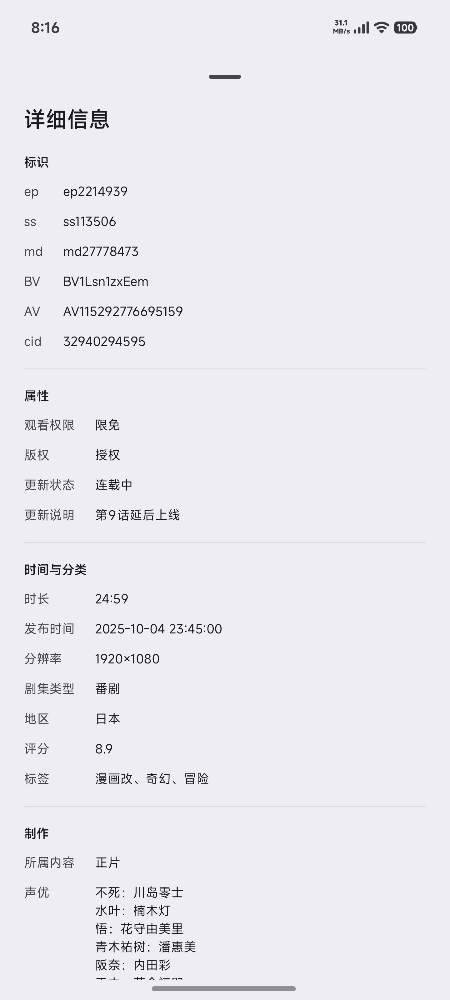</picture></td>
  </tr>
  <tr>
    <td align="center"><b>下载任务</b></td>
    <td align="center"><b>历史记录</b></td>
    <td align="center"><b>我</b></td>
    <td align="center"><b>设置</b></td>
  </tr>
  <tr>
    <td><picture><source media="(prefers-color-scheme: dark)" srcset="./docs/assets/screenshots/05-下载_深色.jpg">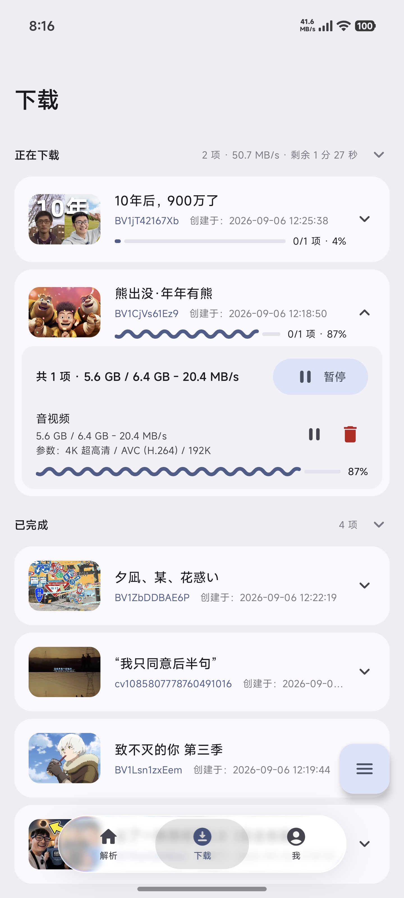</picture></td>
    <td><picture><source media="(prefers-color-scheme: dark)" srcset="./docs/assets/screenshots/06-历史记录_深色.jpg">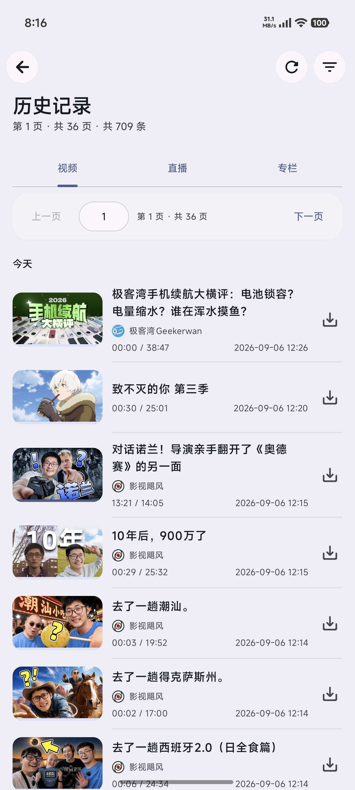</picture></td>
    <td><picture><source media="(prefers-color-scheme: dark)" srcset="./docs/assets/screenshots/07-我_深色.jpg">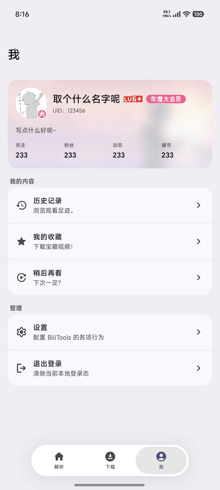</picture></td>
    <td><picture><source media="(prefers-color-scheme: dark)" srcset="./docs/assets/screenshots/08-设置_深色.jpg">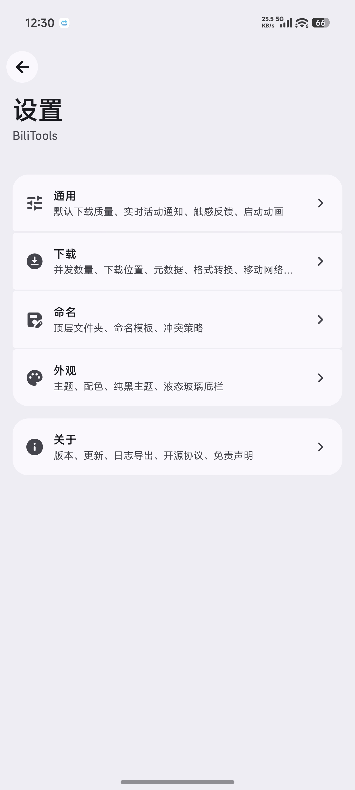</picture></td>
  </tr>
  <tr>
    <td align="center"><b>设置 · 通用</b></td>
    <td align="center"><b>设置 · 下载</b></td>
    <td align="center"><b>设置 · 命名</b></td>
    <td align="center"><b>设置 · 外观</b></td>
  </tr>
  <tr>
    <td><picture><source media="(prefers-color-scheme: dark)" srcset="./docs/assets/screenshots/09-设置-通用_深色.jpg">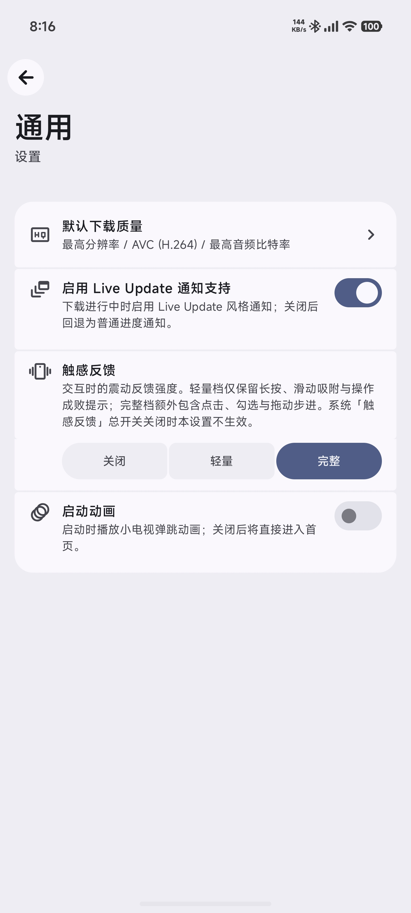</picture></td>
    <td><picture><source media="(prefers-color-scheme: dark)" srcset="./docs/assets/screenshots/10-设置-下载_深色.jpg">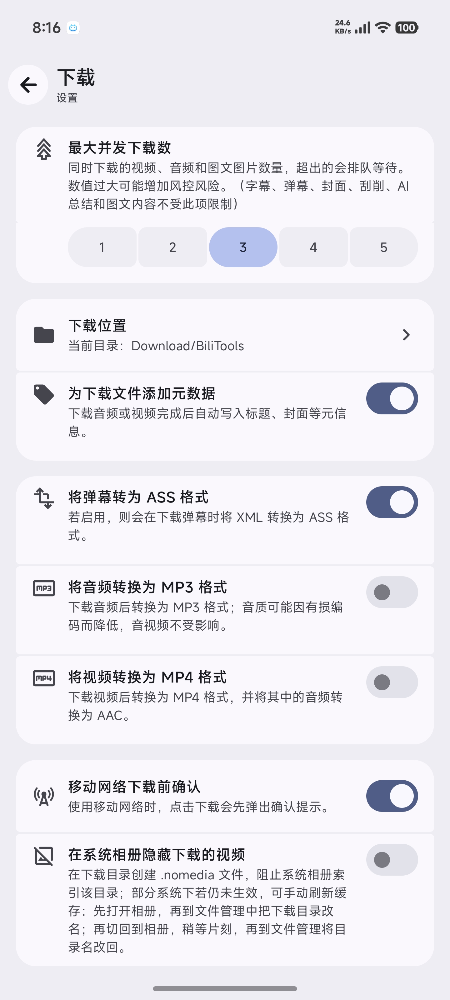</picture></td>
    <td><picture><source media="(prefers-color-scheme: dark)" srcset="./docs/assets/screenshots/11-设置-命名_深色.jpg">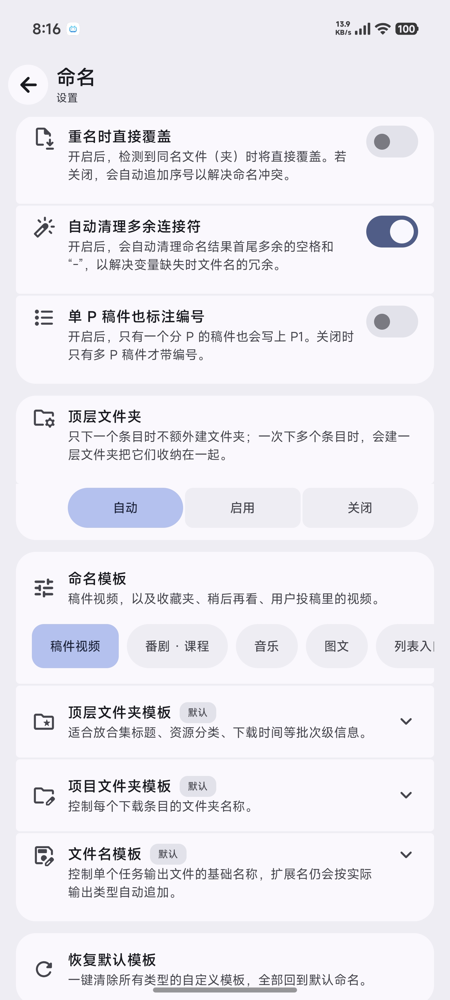</picture></td>
    <td><picture><source media="(prefers-color-scheme: dark)" srcset="./docs/assets/screenshots/12-设置-外观_深色.jpg">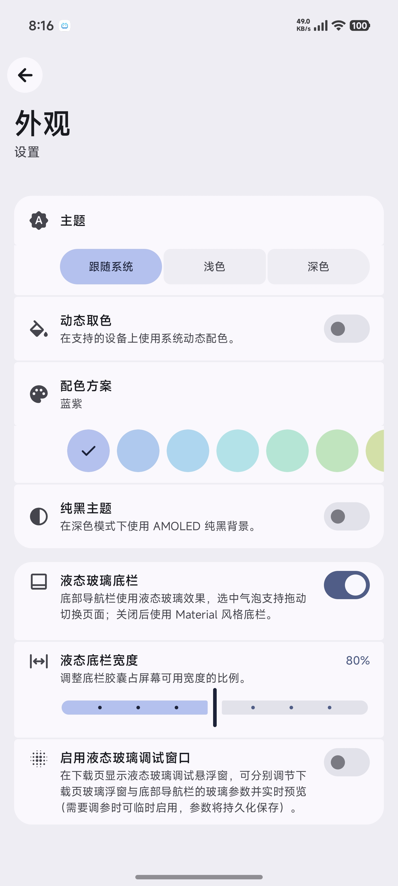</picture></td>
  </tr>
</table>

<br/>

## 🔍 内容解析

> [!TIP]
> **无需专门打开 BiliTools，也无需切换应用。** 在 B 站或其他应用中选择「分享 → BiliTools」，即可在弹出的快捷下载面板中完成解析与下载。

也可在 BiliTools 中粘贴链接或输入 AV、BV 等编号解析内容，并手动选择内容类型。

| 支持的输入格式 | 识别内容 |
|---|---|
| `bilibili.com` / `m.bilibili.com` / `space.bilibili.com` 内容链接、`b23.tv` 短链（支持从分享文本中提取） | 自动识别下列内容类型 |
| `BV…` / `av…` | 稿件视频（含多分 P 视频、联合创作稿件） |
| `ep…` / `ss…` / `md…` | 番剧 · 影视剧集；`cheese` 链接自动解析为课堂课程 |
| `au…` / `am…` | 音频单曲 · 音乐歌单 |
| `cv…` / `opus` 链接 / `rl…` | 专栏文章 · 图文动态 · 专栏文集 |
| `uid…` / 空间链接 | 用户投稿视频、图文、音频，以及空间合集与系列 |
| 收藏夹链接 / 稍后再看链接 | 收藏夹（支持切换子文件夹） / 稍后再看 |

### 内容信息

解析结果展示封面、标题、简介、UP 主信息及粉丝数，以及播放量、弹幕数、评论数、点赞数、投币数、收藏数与分享数等统计数据。标题、简介、封面链接与 UP 主名称均支持长按复制。

打开**详细信息**可查看以下内容，并逐项复制：

- **内容标识**：AV / BV / CID / EP / SS / MD / UID 等标识。
- **内容属性**：自制或转载、限免、大会员专享、互动视频等。
- **基础信息**：所属分区、视频分辨率、投稿或过审时间、发布时间、官方荣誉与榜单排名、作品标签、各分 P 首帧画面。
- **合作成员**：联合创作稿件的成员列表及其分工。
- **影视与课程信息**：番剧、影视的制片地区、站内评分、声优与制作人员；付费课程的价格及连载更新状态。

## 📥 下载与导出

### 音画质与媒体格式

在下载面板中选择画质、音质和需要一并保存的内容。

> [!IMPORTANT]
> 可选画质、音质和附加内容以视频或音频本身提供的内容及当前账号权限为准。登录后可选择账号支持的更多画质与音质。

- **输出类型**：音视频 · 仅视频 · 仅音频。
- **流媒体格式**：DASH（推荐）· MP4 · FLV。
- **分辨率与画质**：8K 超高清 · 杜比视界 · HDR 真彩 · 4K 超清 · 1080P 60 帧 · 1080P 高码率 · 1080P 高清 · 720P · 480P · 360P · 240P。
- **视频编码**：AVC (H.264) · HEVC (H.265) · AV1。
- **音质**：Hi-Res 无损 · 无损 FLAC · 杜比全景声 · 320K · 192K · 132K · 128K · 64K。
- **批量下载质量**：可为整批任务统一设置分辨率与音质，分别选择最高、最低或固定档位。若某项内容不支持指定档位，则自动使用该内容的最高可用档位。

### 附加内容导出

- **字幕**：按语言选择或全选导出 SRT，也可复制纯文本。
- **AI 总结**：导出 B 站提供的 AI 总结为 Markdown，保留分段时间标记，也可一键复制。
- **弹幕**：导出当前弹幕或指定日期的历史弹幕，支持 XML 与 ASS 格式；历史弹幕需登录后获取。
- **NFO 元数据**：将合集或剧集信息保存为 `tvshow.nfo`，也可导出单集 NFO 文件，保留标题、简介、日期、标签、封面等信息，便于整理本地媒体库。
- **封面与海报**：下载封面、方形封面、首帧画面、合集或季度封面、横向海报（16:10 / 16:9）与课程预览图。
- **媒体标签**：在「设置 → 下载」开启「为下载文件添加元数据」，即可在下载完成后自动为 MP3、M4A、MP4、FLAC 文件添加标题、艺术家、专辑、简介、年份、标签与封面。

### 批量下载与文件处理

- **合集与批量下载**：番剧与课程支持按季、版本及正片、预告、特典等分组选集；收藏夹、稍后再看、歌单、文集与空间投稿均可批量勾选，收藏夹还支持切换文件夹与翻页。解析合集中的视频时，可开启「合集模式」，选择多集并下载各集的全部分 P；单 P 视频默认使用稿件标题命名，多 P 视频使用各分 P 标题命名。
- **专栏与图文保存**：支持专栏（`cv`）、图文动态（`opus`）、专栏文集（`rl`）与投稿图文。正文导出为 Markdown，保留标题、作者、时间、引用、列表、代码、公式与图片位置，配图按原始尺寸保存。
- **格式转换**：可在「设置 → 下载」开启「将音频转换为 MP3 格式」或「将视频转换为 MP4 格式」，下载完成后自动转换。
- **文件命名与保存目录**：可在「设置 → 命名」为不同类型的内容设置文件夹与文件名模板，详见[命名模板说明](#命名模板说明)。

> [!TIP]
> 需要在更多设备上播放时，建议选择 AVC (H.264) 编码。转为 MP4 会保留原视频编码，并将其中的音频转为 AAC。

### 下载管理

- **任务分组**：下载任务按作品分组，展开后可查看进度、速度、预计剩余时间、画质与编码等信息（如 `4K 超高清 / HEVC / 192K`），以及下载、合并音视频、转码、转换弹幕、保存文件等处理进度。
- **批量操作**：悬浮菜单提供全部开始、全部暂停、清除已完成记录、清除全部记录与批量管理。
- **打开与分享**：下载完成后，可选择其他应用打开文件，或分享给其他应用。
- **下载通知**：可在通知栏查看总进度，并一键暂停或恢复全部下载；支持 Android Live Update 的设备还可在「设置 → 通用」开启实时通知。
- **并发与存储**：可在「设置 → 下载」调整同时下载的任务数（1 至 5）与保存位置。文件默认保存至 `Download/BiliTools`，也可选择 Download 下的其他子目录。
- **相册显示**：可在「设置 → 下载」开启「在系统相册隐藏下载的视频」开关，让下载的视频不显示在系统相册中。

## 👤 账号与个人内容

- **登录方式**：支持扫码、账号密码与短信验证码登录。登录后可选择账号支持的更多画质与音质。
- **个人中心**：展示头像、等级（含硬核会员）、大会员状态、个性签名、关注/粉丝/动态/硬币与 UID。
- **收藏与稍后再看**：在「我」页打开「我的收藏」或「稍后再看」，即可解析内容并批量下载。
- **历史记录**：按分类（视频 / 直播 / 专栏）与时间浏览，查看观看进度；可搜索关键词，或按时长（10 分钟以下至 60 分钟以上）、时间范围与设备（PC / 手机 / 平板 / TV）筛选。支持跳转页码或滚动查看更多记录，可从视频、番剧、课程与专栏记录直接进入解析页面；直播记录仅供浏览。
- **退出登录**：登录凭证保存在本机，退出登录后会清除本地登录状态。

## ⚙️ 设置

- **通用**：设置默认分辨率与音质（最高 / 最低 / 固定档位）和视频编码；选择触感反馈强度（关闭 / 轻量 / 完整），开启或关闭 Live Update 通知与小电视弹跳启动动画。
- **下载**：调整最大同时下载数量（1 至 5）与保存位置；设置文件元数据、弹幕转 ASS、音频转 MP3、视频转 MP4，以及移动网络下载前确认和相册隐藏选项。
- **命名**：为**稿件视频 / 番剧与课程 / 音乐 / 图文**分别设置**顶层文件夹、项目文件夹与文件名**模板，为**列表入口**设置顶层文件夹模板。可选择是否创建顶层文件夹（自动 / 启用 / 关闭）、重名时覆盖或自动编号，以及是否清理多余连接符、显示单 P 稿件编号。
- **外观**：选择跟随系统、浅色或深色模式，使用动态取色或十三套内置配色；可开启纯黑主题，分别切换液态玻璃底栏和面板，并调整液态底栏宽度。
- **关于**：查看版本并检查更新，更新时自动匹配适合设备的安装包（GitHub Releases，支持镜像加速）；可记录与导出日志，查看开源许可证及免责声明。

### 命名模板说明

命名模板支持三十余个变量与可选片段。稿件视频的默认文件名模板为：

```text
{taskType} - {?(P{p}) }{title}{? - {res}}
```

- **内容变量**：`{title}`、`{work}`、`{collection}`、`{p}`、`{ep}`、`{section}` 等。
- **时间变量**：`{pubtime:YYYY-MM-DD}`、`{downtime:ts}` 等，支持自定义日期格式或时间戳。
- **标识与作者变量**：`{bvid}`、`{aid}`、`{cid}`、`{epid}`、`{upper}`、`{artist}` 等。
- **媒体参数**：`{res}`、`{abr}`、`{enc}`、`{fmt}`，分别表示分辨率、音频比特率、视频编码与流媒体格式。

`{? … }` 内任一变量为空时，整个可选片段及其中的括号、空格与连接符一并省略。

<a id="界面设计"></a>

## ✨ 设计：Material 3 Expressive × 液态玻璃

- **Material 3 Expressive**：采用 Expressive 主题与动效，包含形状变换的加载指示器、连接式按钮组、展开式悬浮操作菜单、拆分按钮，以及随滚动折叠的大标题栏。
- **液态玻璃**：底部导航采用透明、模糊与折射效果，支持拖动选中项切换页面与调整底栏宽度。下载任务的打开与分享菜单、批量管理面板采用相同的玻璃效果。在「设置 → 外观」中可分别开关「液态玻璃底栏」与「液态玻璃面板」，两项默认开启；关闭后使用 Material 风格，面板布局保持一致。Android 13 以下或未启用硬件加速时自动使用 Material 风格，面板实心背景跟随配色，深色与纯黑模式补充细描边。
- **系统交互**：支持边到边显示（Edge-to-Edge）、预测性返回手势，以及按操作类型区分的触感反馈（轻量 / 完整）。
- **趣味启动动画**：应用启动时播放小电视弹跳动画，可在「设置 → 通用」中开启或关闭。
- **主题切换**：支持浅色、深色与纯黑模式，配色调整即时生效，无需重启应用。

## 🌈 配色系统

BiliTools 的配色以**淡雅、清新、明亮**为基调。适中的饱和度保留色彩个性，柔和的填充与清晰的明暗层次让浅色界面轻盈、深色界面干净，并兼顾长时间浏览时的阅读体验。

<picture>
  <source media="(max-width: 600px) and (prefers-color-scheme: dark)" srcset="./docs/assets/palette-dark-mobile.svg">
  <source media="(max-width: 600px)" srcset="./docs/assets/palette-light-mobile.svg">
  <source media="(prefers-color-scheme: dark)" srcset="./docs/assets/palette-dark.svg">
  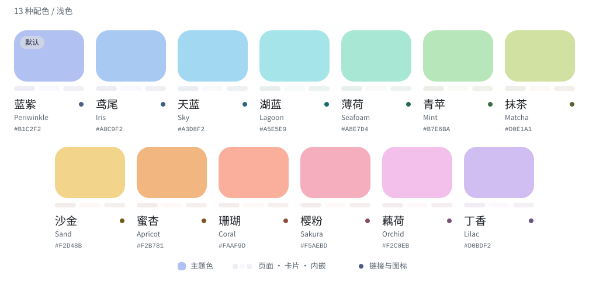
</picture>

BiliTools 提供十三套原创 Material 3 配色，可在「设置 → 外观」中选择。每套配色都覆盖按钮、背景、卡片、文字与边框，并适配浅色和深色模式。

其中，**樱粉**以柔和的粉色呼应 B 站，饱和度较品牌粉更克制，与淡雅的页面底色相协调；**蓝紫**以 Android 16 默认 Monet 的蓝灰色系为基础，喜欢这一风格也可以直接选用。

[动态取色](https://developer.android.com/develop/ui/compose/designsystems/material3#dynamic_color)默认开启，在 Android 12 及以上系统中让界面配色随系统壁纸变化。关闭后恢复上次手动选择的内置配色；从未手动选择过时，默认使用**蓝紫**。切换时界面布局保持不变，动态配色的颜色由系统决定。

各套内置配色保持一致的明暗层次与阅读体验：

- **柔和且深浅一致的填充色**：主按钮、选中胶囊与滑条已选段采用明亮、饱和度适中的主题色，浅色模式下也保持轻盈。它们在切换明暗模式时保持同色，与设置页色块一致，对应 `primaryFixedDim` 颜色角色。配色以最大 sRGB 通道为基准调整明度，并限制彩度与明度上限，使冷暖色的视觉强度更加均衡。
- **清晰的背景层次**：页面、卡片、内嵌区域与激活状态通过同色相的明度差区分。浅色页面仅保留轻微着色，卡片采用柔和的近白色，内嵌区域保留细微色调，在区分层次的同时减少灰暗感；深色背景降低着色量，减少暗部偏色，保持干净的观感。
- **清楚的文字与轻盈的边框**：浅色正文与次要文字采用足够深的颜色，在柔和背景上保持清晰。两者分别采用 HCT 明度 T10、T30，与卡片背景的对比度约为 16:1、8.9:1；细线边框采用 T80，保持 1 dp 边框清晰而不过于突出。
- **错误提示色**：各套配色均沿用 Material 3 基线错误色阶。浅色模式下，删除等操作使用浅红色背景，便于识别并与整体配色协调。
- **纯黑主题**：开启后，深色页面使用 `#000000` 纯黑背景，卡片与内嵌区域保留深灰色层次，适合 AMOLED 屏幕；可与内置配色或动态取色搭配使用。

内置配色由官方 [Material Color Utilities](https://github.com/material-foundation/material-color-utilities) 按 Material 3 Expressive 2025 规范的 Tonal Spot 方案生成，并针对填充色、背景层次与文字对比度进行调整。基础配色以 Android 16 默认 Monet 色表校验，蓝紫方案以该色表的种子色相 269° 为基准。

生成器、回归校验（对比度、层次分离度、角色一致性）与设计说明见 [`docs/配色系统/`](./docs/配色系统/README.md)。

## 📦 安装

前往 [Releases](https://github.com/happycola233/BiliTools/releases/latest) 下载最新 APK。提供 `arm64-v8a`、`armeabi-v7a`、`x86`、`x86_64` 及通用包，主流手机建议选择 **arm64-v8a**。

- **系统要求**：Android 10（API 29）及以上。
- **应用内更新**：在「设置 → 关于」点击「检查更新」，即可下载适合当前设备的安装包。

## 🛠️ 构建

需要 JDK 17 或以上版本与 Android SDK Platform 37，依赖由 Gradle 自动解析。

```bash
git clone https://github.com/happycola233/BiliTools.git
cd BiliTools
./gradlew assembleDebug
```

Windows 环境使用 `gradlew.bat assembleDebug`。

### 技术栈

| 分类 | 核心技术与依赖库 |
|---|---|
| 语言与架构 | Kotlin 2.4 · Jetpack Compose 1.12 · Material 3 1.5.0-alpha27（Expressive）· Navigation 3 |
| 网络与数据 | OkHttp 5 · Moshi · Coil 3 |
| 媒体处理 | FFmpeg-Kit 6.1（合并、转码与封装）· JAudiotagger 3（媒体标签写入）· 内置弹幕解析与 ASS 转换 |
| 界面视觉 | Backdrop（液态玻璃模糊）· Material Color Utilities（调色板生成） |
| 目标平台 | minSdk 29 · targetSdk 36 · compileSdk 37 |

## ⚠️ 免责声明

- **本地数据**：登录凭证、设置与下载记录以明文保存在本地设备，应用不提供这些数据的云端同步服务。请妥善保管设备与导出的文件。
- **用户责任**：因使用本项目而产生的任何后果均由用户个人承担，与开发者无关。
- **版权声明**：「哔哩哔哩」及「Bilibili」名称、LOGO 及相关图形是上海幻电信息科技有限公司的注册商标或商标。本项目与哔哩哔哩及其关联公司无任何关联、合作、授权或背书关系。

## 📜 开源协议

本项目基于 [GPL-3.0-or-later](LICENSE) 协议开源。
